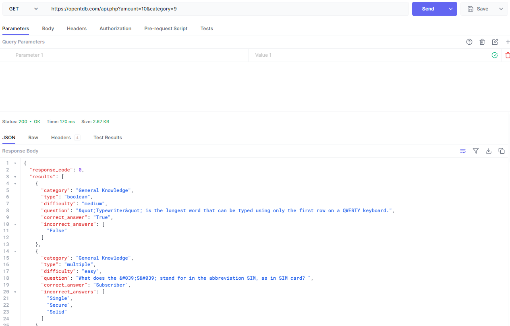

# Group-Project
We are making a trivia application with support for speech input/output, with support for self-designed questions and randomly generated questions.
The application will be on mobile/web.

Trivia API: https://the-trivia-api.com/

The Trivia Database: https://opentdb.com/api_config.php (Results below)

Java API call
```java
HttpRequest request = HttpRequest.newBuilder()
.uri(URI.create("https://opentdb.com/api.php?amount=10&category=9"))
.method("GET", HttpRequest.BodyPublishers.noBody())
.build();
HttpResponse<String> response = HttpClient.newHttpClient().send(request, HttpResponse.BodyHandlers.ofString());
System.out.println(response.body());
>>> {"response_code":0,"results": (OMITTED FOR BREVITY)}
```

API call with (https://hoppscotch.io/)

 
